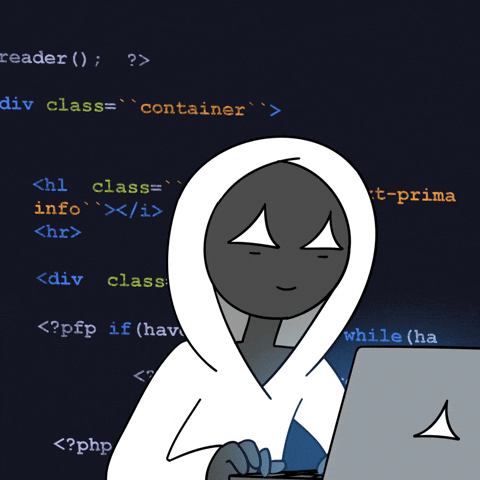

---

## ⚡ About Me

  <table border="0">
    <tr>
      <td width="80%" valign="middle">
        
👋 Hey, I'm <strong>Shubham</strong>! I am a creative developer who loves building <strong>fast, interactive, and visually stunning web interfaces</strong>.

        
🎨 With a strong background in graphic design, I bring a unique blend of aesthetic precision and clean engineering to every project. I care deeply about how things look, feel, and function.

        
📍 Delhi, India

      </td>
      <td width="20%" align="" valign="bottom">
        
      </td>
    </tr>
  </table>

---

## 🛠️ Tech Stack & Tooling

| Section | Technologies |
| :--- | :--- |
| **Frontend Core** |     |
| **Libraries & Frameworks** |    |
| **Motion & Animation** |   |
| **Backend & Databases** |   |
| **Design & Versioning** |   |

---

## 🚀 Featured Projects

| Project | Description / Key Highlights | Stack | Live Demo |
| :--- | :--- | :--- | :--- |
| **Nexus Arena** | Gaming tournament platform featuring brackets, live leaderboards, and user registration. | `React`, `Tailwind`, `REST APIs` | [**Visit Live**](https://nexusarena.vercel.app/) |
| **AIWay** | Aggregator platform to discover and compare AI courses across top learning sites. | `React`, `Tailwind CSS` | [**Visit Live**](https://aiway.vercel.app/) |
| **DAM Craft Events** | Luxury Event Management site featuring custom cursor & GSAP scroll animations. | `HTML`, `CSS`, `GSAP`, `React` | [**Visit Live**](https://damcraftevents.vercel.app/) |

---

## 🏆 Certifications & Achievements

- 🎓 **Meta Front-End Developer Specialization** — React.js & modern UI/UX *(Meta, 2024)*
- 🌍 **Stanford Code in Place 2025** — Selected in the **top 30% globally** *(Stanford University, 2025)*
- 📜 **Web Development Certification** — HTML, CSS, JS, React *(Internshala, 2022)*

---

## 📊 GitHub Dashboard

  <table border="0">
    <tr>
      <td align="center">
        
      </td>
      <td align="center">
        
      </td>
    </tr>
  </table>

  

---

## 🔗 Connect With Me

---

